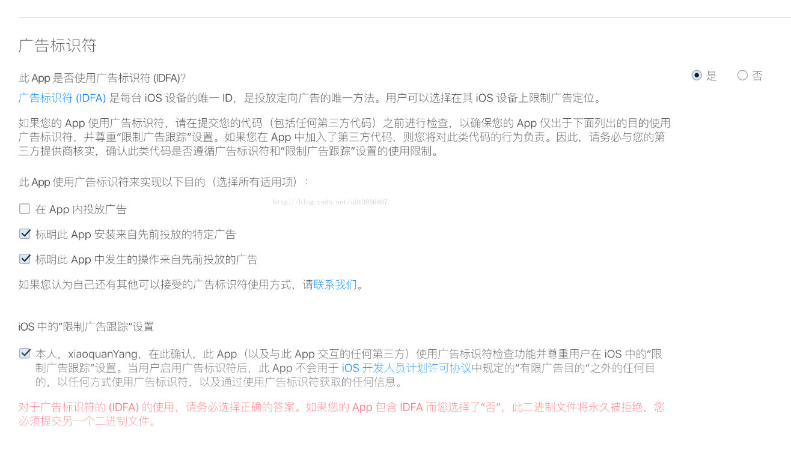

# 项目说明

通过IDFA+KEYCHAIN的方式获取ios的唯一设备id.

具体文档说明请参考：http://www.jason-z.com/post/22

# 安装

```
cordova plugin add cordova-plugin-keychain-idfa
```

# 调用

## 从keychain中获取设备ID

```
var args = {
  'key':'com.jason-z.test.idfa'
};

KeychainIDFA.getDeviceID((id)=>{
 console.log(id);   
},(err)=>{
    console.log(err);
})
```

##  从keychain中删除设备ID

```
var args = {
  'key':'com.jason-z.test.idfa'
};

KeychainIDFA.deleteDeviceID((id)=>{
 console.log(id);   
},(err)=>{
    console.log(err);
})
```

*此处的key是用来标识keychain存储的键值，可定义。*


# 演示


# 其他说明

由于引入了AdSupport.Framework，并且你的应用里没有接入广告，需要在提交到appstore审核的时候正确勾选，参考如下：





# 赞赏

如果我的插件帮助到了你，欢迎赞赏。


